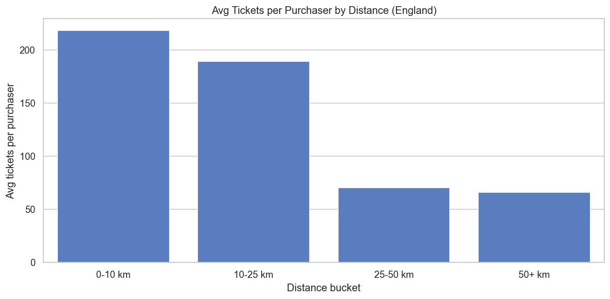
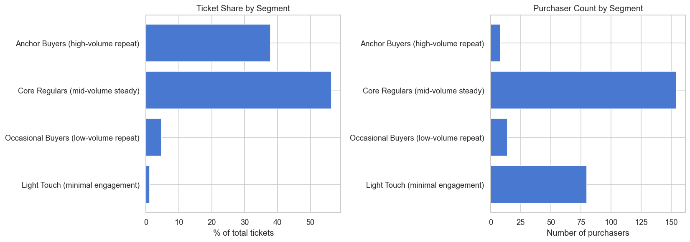
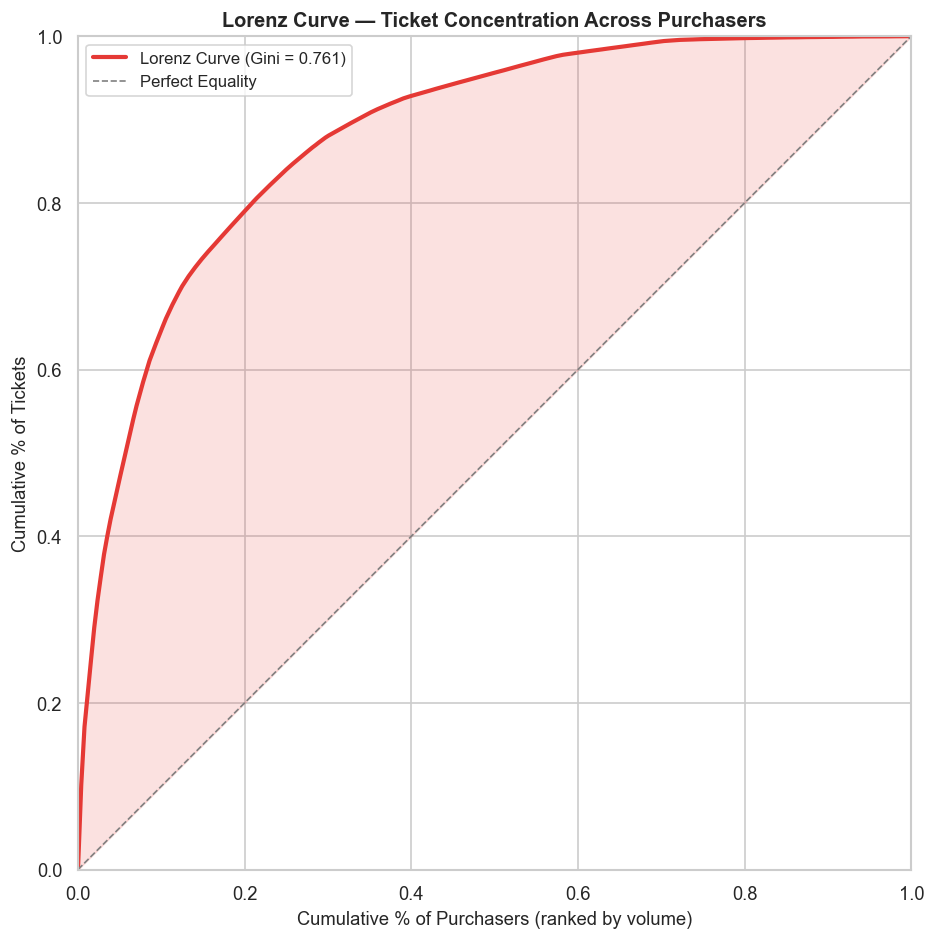

# Sheffield United FC: Hospitality Data Technical Assessment

**Prepared by:** Varun Rout  
**Date:** February 2026  
**Scope:** Ticket sales and customer data analysis across SUFC hospitality suites (2024/25 & 2025/26 seasons)

---

## Introduction

When I first opened these two datasets (43,289 ticket transactions and 277 customer records), I expected a fairly typical consumer ticket analysis. What I actually found was a story about corporate hospitality dependency, hidden guests, and a growth segment hiding in plain sight.

This document walks through my findings across the three assessment sections. I have tried to structure it as a narrative rather than a checklist, keeping the insights grounded in the data and the recommendations commercially motivated.

The full analysis lives in three Jupyter notebooks:

1. **01_data_loading_and_cleaning.ipynb**: Data quality exploration and cleaning
2. **02_behavioral_analysis.ipynb**: Purchasing patterns, concentration, repeat behaviour, and behavioural clustering
3. **03_demographic_analysis.ipynb**: Demographics, geography, and demographic × behaviour clustering

All charts referenced below are saved in `data/charts/` and produced reproducibly from the notebooks.

---

# Section 1: Data Quality Analysis

## 1.1 What I Found

I loaded both CSVs and performed a systematic exploration: shape, types, missingness, uniqueness, referential integrity, and value validation.

**Ticket Sales** (`ticket_sales.csv`): 43,289 rows, 10 columns, zero missing values. Every transaction has a valid `purchaser_id`, `owner_id`, event date, area, and seat. Clean enough to work with immediately.

**Customers** (`customers.csv`): 277 rows, 9 columns, but with some meaningful gaps:

| Column | Missing | % | Root Cause |
|--------|---------|---|------------|
| `country` | 14 | 5.1% | Incomplete CRM entry |
| `district` | 28 | 10.1% | Non-England customers (no English admin divisions) |
| `ward` | 28 | 10.1% | Same as above |
| `distance_to_bramall_lane_km` | 28 | 10.1% | Derived from district/ward |
| `age` | 109 | 39.4% | 71 are Accounts (businesses), 21 are individuals with missing data |

The 39.4% missing age looks alarming at first glance. However, 71 of those 109 are corporate Accounts (business entities where age simply does not apply). The real individual missing-age rate is 21 out of 202 individuals (10.4%), which is manageable.

## 1.2 Cleaning Steps I Took

| Step | Action | Result |
|------|--------|--------|
| 1 | Converted `transaction_date` and `event_date` to datetime | Enabled date validation |
| 2 | Checked for duplicate `customer_id` values | 0 duplicates found |
| 3 | Checked for duplicate `transaction_id` values | 0 duplicates found |
| 4 | Created `is_england_customer` flag for 28 non-England customers | Retained all customers, flagged for conditional filtering |
| 5 | Validated referential integrity (`purchaser_id`/`owner_id` ↔ `customer_id`) | All IDs match, no orphan tickets |
| 6 | Validated `transaction_date ≤ event_date` | All valid |
| 7 | Validated age range (0–120) | All valid |
| 8 | Validated distance is positive (England customers) | All valid |

An important decision here: I retained all 277 customers and all 43,289 tickets. Nothing was excluded. Non-England customers were flagged rather than dropped, because excluding them would bias the analysis toward local fans and potentially remove high-value corporate clients.

| Dataset | Original | After Cleaning | Retained |
|---------|----------|----------------|----------|
| Customers | 277 | 277 | 100% |
| Tickets | 43,289 | 43,289 | 100% |

## 1.3 How I Would Continuously Monitor Data Quality

In a production environment, I would implement three layers:

**Layer 1: Automated validation on every data load**, using a framework like Great Expectations:

```python
# Example validation rules
expect_column_values_to_be_unique("customer_id")
expect_column_values_to_not_be_null("transaction_id")
expect_column_values_to_be_between("age", 0, 120)
expect_column_pair_values_A_to_be_less_than_B("transaction_date", "event_date")
```

**Layer 2: Threshold-based alerting**

| Metric | Target | Alert Trigger |
|--------|--------|---------------|
| % Missing age (individuals only) | < 5% | Exceeds 10% |
| Duplicate customer IDs | 0% | Any detected |
| Unmatched ticket ↔ customer IDs | 0% | Any detected |
| % Non-England without country | 0% | Any new gaps |

**Layer 3: CRM enforcement at point of entry**
- Make postcode mandatory for individual customers
- Separate Account vs Customer profile templates (Accounts have no meaningful age/gender)
- Add a `data_source` field to track where each record originated

Ultimately, the goal is not just clean data for this one-off analysis. It is clean data as a permanent, reusable asset.

---

# Section 2: Key Demographics

## 2.1 First, a Critical Discovery: Who Are We Actually Analysing?

Before diving into demographics, I needed to understand a structural feature of this data that changes everything.

The 277 customers split into two types:
- **75 Accounts**, generating 77.6% of all tickets (33,594 of 43,289)
- **202 Customers (individuals)**, generating 22.4% (9,695 tickets)

The Accounts are not what I initially assumed. They are not resellers like Ticketmaster. The data makes this fairly clear:

- 83.1% of Account tickets are "Season Ticket Holder", i.e. season-long commitments
- They sit exclusively in premium hospitality areas (The Pavilion, Tony Currie Suite, 1889 Restaurant)
- Top Accounts buy exactly 16 or 36 seats per match, suggesting standardised table/box packages
- All 75 have `gender = Unspecified` and `age = null` (they are business entities, not people)

In short, Accounts are corporate hospitality clients holding season-long premium packages. The hospitality product is fundamentally B2B. The demographic analysis that follows therefore applies mainly to the individual segment, which is where the growth opportunity sits.

## 2.2 The Individual Customer Profile

### Age: Older and Affluent


The individual hospitality fan base skews mature:

- **Mean age: 57.2** | **Median: 58.5**
- **47.0%** are 60+ (among the 168 with reported ages)
- Only **6.5%** are 18–29

This is not a "mass fan" demographic. These are established, likely affluent individuals who can afford premium matchday hospitality (typically £100+ per head). The age profile fits the product: fine dining, premium seating, corporate-adjacent experiences.

Commercially, the current base is stable but ageing. If the club wants to future-proof individual hospitality revenue, it needs a deliberate gateway for younger professionals. That could look like entry-level hospitality packages (matchday lounge access without the full suite commitment) or group experience products aimed at 30-to-45 year olds.

### Gender: Male-Dominated, But with Gaps

- **71.8% Male** | **9.4% Female** | **18.8% Unspecified**

The 18.8% "Unspecified" makes it difficult to draw hard conclusions. But even accounting for that, women are clearly underrepresented. There could be an underserved opportunity here (women's hospitality events, mixed-group packages, or simply better marketing to female professionals), though I would want better data capture before investing heavily.

### Geography: Hyperlocal Is High-Value



Geography is one of the clearest predictive signals in this data:

| Distance from Bramall Lane | Avg Tickets/Purchaser | Repeat Rate |
|---------------------------|----------------------|-------------|
| **0–10 km** | **218.4** | 96.5% |
| **10–25 km** | **189.0** | 95.0% |
| **25–50 km** | 70.1 | 100% (small base) |
| **50+ km** | 66.0 | 83.3% |

Customers within 25 km of Bramall Lane buy roughly 3x more tickets than those further away. That is not surprising (proximity reduces the friction of attending 20+ matches per season), but it does quantify the opportunity: local acquisition within 0-25 km should be the primary individual growth lever.

England-based customers account for 98.2% of ticket volume. Non-England customers (25 purchasers, 1.8% of tickets) are real but currently niche. They show a strong 92% repeat rate, which suggests dedicated fans who travel specifically for hospitality. Worth cultivating as a high-margin segment, but not one to rely on for scale.

## 2.3 How Has the Demographic Changed Over Time?

Season-over-season trends (excluding 2023/24, which had only 223 tickets from a single purchaser, likely pre-season residual data):

| Metric | 2024/25 | 2025/26 |
|--------|---------|---------|
| Total tickets | 23,355 | 19,711 |
| Unique purchasers | 204 | 155 |
| Avg tickets/purchaser | 114.5 | 127.2 |
| Account share | 80.0% | 75.6% |
| Repeat rate | 95.1% | 96.1% |

The headline is that there are fewer purchasers, but each one is spending more. The 2025/26 season may be incomplete, so the volume decline might not be real. Still, the purchaser count drop is worth watching. On the positive side, the Account share decreased slightly (80% to 75.6%), meaning individual Customer participation is growing marginally.

## 2.4 Who Is Our Target Audience?

Based on the data, the hospitality suite serves two distinct audiences:

**Primary audience (77.6% of volume):** Corporate clients. Businesses purchasing season-long hospitality packages for client entertainment, staff rewards, and corporate relationship-building. These are B2B sales relationships, not consumer marketing targets.

**Secondary audience (22.4% of volume, but the growth lever):** Individual fans who are:
- Predominantly male (72%), aged 50+ (68%), local to Sheffield (within 25 km)
- Split 50/50 between season ticket holders and match-by-match buyers
- Highly loyal (93% repeat rate)
- The "local affluent professional/retiree" archetype

**Underserved segments** (growth opportunities):
- Women (currently 9.4% of individuals)
- Younger fans aged 18–39 (currently 15% of individuals)
- Non-England fans (small but high-engagement)

## 2.5 Machine Learning Techniques to Drive Ticket Sales

Given the data available and the commercial context, I would recommend three ML approaches, in order of practical impact:

### 1. Customer Segmentation via Clustering (Implemented)

I have already implemented this in the notebooks:

**Behavioural clustering (all 256 purchasers, KMeans k=4):**



| Segment | Purchasers | Avg Tickets | Ticket Share |
|---------|-----------|-------------|-------------|
| Anchor Buyers | 8 | 2,046 | 37.8% |
| Core Regulars | 154 | 159 | 56.4% |
| Occasional Buyers | 14 | 146 | 4.7% |
| Light Touch | 80 | 6 | 1.1% |

**Demographic × behaviour clustering (181 individuals, KMeans k=3):**


| Segment | Individuals | Avg Age | Avg Distance | Avg Tickets | Ticket Share |
|---------|------------|---------|-------------|-------------|-------------|
| High-Value Local Regulars | 80 | 64.9 | 16 km | 102 | 84.2% |
| Mid-Engagement Steady Fans | 32 | 55.9 | 300 km | 19 | 6.3% |
| Low-Volume Occasionals | 69 | 49.3 | 18 km | 13 | 9.5% |

These segments are directly actionable. Each one calls for a different retention strategy, a different type of offer, and a different communication frequency.

### 2. Churn Prediction (Random Forest / Gradient Boosting)

**Problem:** Identify which current buyers are at risk of not renewing for the next season.

**Features I would use:**
- Ticket volume trend (this season vs last)
- Recency of last purchase
- Number of events attended
- Whether they increased or decreased activity
- Client type (season vs match-by-match)
- Customer type (Account vs Individual)

**Why it matters:** With 94% repeat rates, losing even a few key accounts or high-value individuals would hit revenue hard. A churn model enables preemptive outreach (a phone call from a relationship manager, an early-bird renewal discount, a complimentary upgrade) before the decision to leave is finalised.

**Data requirement:** At least 2-3 seasons of data to define "churned" vs "retained" labels. The current dataset covers two full seasons, which is borderline. A third season would make this robust.

### 3. Next-Best-Offer / Propensity Modelling (Logistic Regression / XGBoost)

**Problem:** For Light Touch and Occasional Buyers, predict which product or offer is most likely to convert them into Core Regulars.

**Features:**
- Current segment assignment
- Areas previously visited
- Events attended (which fixtures)
- Distance to Bramall Lane
- Age and gender

**Output:** A per-customer score for each available product (e.g., "3-match taster package", "season upgrade", "group hospitality experience"), enabling personalised marketing at scale.

**Data requirement:** Would benefit from additional data not currently in the dataset: marketing campaign exposure, email engagement, website visits, and offer acceptance/rejection history.

### 4. Collaborative Filtering for Event Recommendations

**Problem:** Which upcoming fixtures should be marketed to which customers?

**Approach:** Treat the purchaser × event matrix as a recommendation problem. Customers who attend similar fixtures likely share preferences. For a match-by-match buyer, recommend fixtures that similar buyers attended but they haven't yet booked.

**Practical use:** Targeted email campaigns along the lines of "Fans like you also attended [fixture X], book your hospitality now." Particularly relevant for the 49.4% of individual tickets that are match-by-match purchases.

---

# Section 3: Additional Recommendations & Insights

## 3.1 The Hidden Guest Problem

This is probably the most commercially important finding in the analysis.

Every corporate Account has `owner_id = purchaser_id` for every ticket. When Account #1 buys 113 seats for a match, all 113 are recorded as owned by Account #1. The actual people sitting in those seats (clients, staff, partners, guests) are invisible in the data.

Why this matters:
- 77.6% of all tickets (33,594) are purchased by Accounts
- At typical corporate hospitality usage rates, thousands of individuals experience the product each season but are completely unknown to the club
- These "hidden guests" are probably the largest untapped marketing pool: people who have already experienced premium hospitality and could potentially be converted into individual buyers or corporate advocates

I would recommend working with the CRM/ticketing team to investigate whether `owner_id` can capture individual guest names for Account tickets, even at a basic level. Post-event QR check-ins, digital seat assignments, or simple guest registration forms at hospitality reception would unlock this data.

## 3.2 Revenue Concentration Is a Real Risk



The Gini coefficient is **0.761** across all purchasers. To put that in context:

- **5 buyers** control **29%** of all tickets
- **10 buyers** control **42%**
- **20 buyers** control **58.5%**
- The **bottom 50%** of purchasers contribute just **4.4%**

Every single top-10 purchaser is a corporate Account. The largest alone holds 10.2% of all hospitality tickets. Some level of corporate concentration is normal for a B2B hospitality product, but it does mean the club's revenue stability is directly tied to the satisfaction of perhaps 8-10 senior commercial relationships.

A formal key account management programme feels essential here. The top 20 accounts (controlling 58.5% of revenue) should each have a named relationship manager, quarterly business reviews, priority renewal windows, and bespoke service level agreements. This is standard practice in B2B enterprise sales, and it should apply to hospitality too.

## 3.3 The Light Touch Conversion Opportunity

The behavioural clustering identified 80 "Light Touch" purchasers, averaging just 6 tickets and 1.5 events each. They are 86% individual customers and collectively account for only 1.1% of ticket volume.

The commercial opportunity here is that these 80 people have already overcome the hardest barrier: they have tried the product. They know what hospitality at Bramall Lane looks and feels like. Converting even 20% of them into Core Regulars (moving them from 6 to 50+ tickets per season) would add meaningful individual revenue and reduce corporate concentration risk.

Targeted levers:
- **Post-first-visit follow-up** within 48 hours (email, personal call, or WhatsApp)
- **"Return for 3, save 20%"** multi-match taster packages designed for low-engagement buyers
- **Group hospitality offers**, since many one-time visitors may have attended as someone else's guest and need a reason to buy on their own
- **Birthday or milestone offers**, where age data enables personalised outreach

## 3.4 The Ageing Core

The High-Value Local Regulars (80 individuals generating 84.2% of individual ticket volume) have an average age of 64.9. This is a loyal, high-spending base today, but it does represent a generational succession challenge over the next 5-10 years.

The Low-Volume Occasionals, by contrast, average 49.3 years old and are overwhelmingly local (100% England, avg 18 km). They are already geographically positioned and product-aware, just under-engaged. This segment is the natural recruitment pool for the next generation of high-value individuals.

I would suggest creating an explicit pipeline from Occasional to Regular:
- Entry-level "lounge access" products (cheaper than full suite, introduces the hospitality experience)
- Flexible mini-season packages (pick 5 or 10 matches instead of committing to all)
- Referral incentives from existing High-Value regulars to their networks

## 3.5 The Gifting Trend Is Small but Growing

Recorded gifting (where `purchaser_id ≠ owner_id`) is just 2.6% overall, but it doubled from 1.8% (2024/25) to 3.7% (2025/26). This is entirely driven by individual Customers (11.8% gifting rate among individuals; 0% among Accounts because of how the data model works).

When individuals gift, 68% goes to other individuals and 32% goes to Accounts. This could represent:
- Friends buying hospitality tickets for each other
- Individuals gifting into corporate accounts (e.g., a fan buying a seat in a corporate box)
- Social/referral behaviour growing organically

It is worth leaning into this. A formal referral programme ("Gift a hospitality experience, your friend gets 15% off their first match") could accelerate what appears to be organic word-of-mouth growth.

## 3.6 Product Geography: Three Distinct Hospitality Spaces

All tickets sit across three hospitality areas:

| Area | Share of Tickets (approx.) |
|------|---------------------------|
| The Pavilion | ~58% |
| Tony Currie Suite | ~22% |
| 1889 Restaurant | ~20% |

The Pavilion dominates volume, likely reflecting its larger capacity and standardised corporate packages. The Tony Currie Suite and 1889 Restaurant may serve different tiers or experiences.

Worth doing next: analysing conversion rates and repeat behaviour by area. If one area has noticeably higher first-visit-to-return rates, it should be prioritised for trial/taster experiences. If another has higher average spend, it might be the right venue for premium upsell offers.

---

# Summary

Sheffield United's hospitality operation is a high-loyalty, corporate-dependent, hyperlocal product with clear strengths and specific growth levers.

**What is working well:**
- 94% repeat purchase rate, which is exceptional
- Season-long corporate commitments provide revenue stability
- Strong hyperlocal individual base (0-25 km) with deep engagement

**What needs attention:**
- Revenue is heavily concentrated: 8 Anchor Buyers hold 37.8% of tickets
- The individual segment is under-developed (22.4% of volume from 181 purchasers)
- The core individual base is ageing (avg 65 for the High-Value segment)
- The CRM does not track who actually sits in corporate seats, meaning potentially thousands of hidden guests are invisible

**What I would do next (prioritised):**

| Priority | Action | Expected Impact |
|----------|--------|----------------|
| **Critical** | Implement key account management for top 20 corporate buyers | Protect 58.5% of revenue |
| **Critical** | Capture guest-level data for Account seats | Unlock insight into thousands of hidden end-users |
| **High** | Build Light Touch → Core Regular conversion programme | Grow individual base, reduce concentration risk |
| **High** | Design segment-specific retention playbooks | Right strategy for each of the 4 behavioural segments |
| **Medium** | Create entry-level hospitality products for younger/casual fans | Future-proof against ageing core |
| **Medium** | Launch a formal referral programme | Capitalise on growing gifting trend |
| **Medium** | Build churn prediction model (once 3 seasons of data exist) | Preemptive retention for at-risk buyers |

---

## Appendix: Charts Referenced

All charts are generated from the analysis notebooks and saved in `data/charts/`:

| Chart | File | Notebook |
|-------|------|----------|
| Lorenz curve (ticket concentration) | `lorenz_curve.png` | NB02 |
| Tickets per purchaser distribution | `tickets_per_purchaser_distribution.png` | NB02 |
| Repeat vs one-time comparison | `repeat_vs_onetime.png` | NB02 |
| Season-over-season comparison | `season_comparison.png` | NB02 |
| Behavioural segments (bar chart) | `nb02_behavioural_segments.png` | NB02 |
| Behavioural clustering elbow plot | `nb02_elbow_plot.png` | NB02 |
| Individual age distribution | `nb03_individual_age_distribution.png` | NB03 |
| Individual gender split | `nb03_individual_gender_split.png` | NB03 |
| Age vs ticket volume scatter | `nb03_age_vs_ticket_volume.png` | NB03 |
| Distance vs ticket volume | `nb03_distance_vs_ticket_volume.png` | NB03 |
| Avg tickets by distance bucket | `nb03_avg_tickets_by_distance.png` | NB03 |
| England vs non-England ticket share | `nb03_england_vs_nonengland_ticket_share.png` | NB03 |
| Individual segments scatter | `nb03_individual_segments_scatter.png` | NB03 |
| Individual clustering elbow plot | `nb03_elbow_plot_individuals.png` | NB03 |

---

*Analysis conducted using Python 3.13 with pandas, numpy, matplotlib, seaborn, and scikit-learn. Full code available in the accompanying Jupyter notebooks.*
